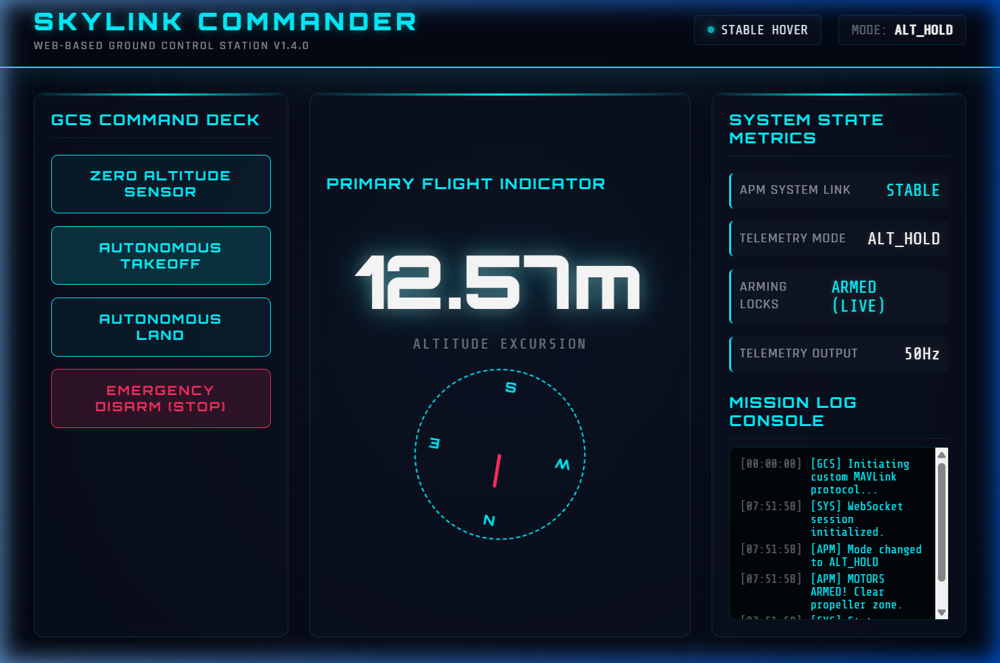

# SkyLink Commander

Web-based ground control station running on a Raspberry Pi 4, bridging a browser HUD to an APM 2.8 flight controller over MAVLink. Built because Mission Planner is overkill for simple autonomous missions and doesn't run well on Pi — I wanted a lightweight custom GCS I could access from any device on the same network.

## 📸 Web HUD Dashboard Interface
<div align="center">
  
  <p><i>Asynchronous Glassmorphism HUD Dashboard with Live Telemetry Tracking & Mission Control Console</i></p>
</div>

---


## What it does

`commander.py` opens a MAVLink serial connection to the APM 2.8, starts a Flask web server, and streams live telemetry to a browser dashboard over WebSocket. The HUD shows heading, altitude, airspeed, battery voltage, and flight mode — updating every 500ms. Takeoff and landing are triggered from the browser with a single button, which calls the pre-arm check sequence first.

```
Browser (any device) ←→ WebSocket ←→ Flask (RPi 4)
                                          ↓
                                   MAVLink serial
                                          ↓
                                      APM 2.8
                                          ↓
                                       Motors
```

## 🔌 Wiring Schematic & System Topology

The physical hardware connects the Raspberry Pi 4's USB serial controller directly to the APM 2.8's UART port using a bi-directional CP2102 USB-to-TTL Serial adapter.

```mermaid
graph TD
    subgraph Client Layer
        Browser[Any Client Device Browser]
    end

    subgraph Server Layer (Raspberry Pi 4)
        WebUI[FastAPI Web Server]
        WSS[WebSocket Telemetry Server]
        Browser <-->|HTTP Request Port 8000| WebUI
        Browser <-->|WebSocket Stream| WSS
    end

    subgraph Hardware Link
        CP2102[CP2102 USB-to-TTL Adapter]
        WSS <-->|Async Serial Read/Write| CP2102
    end

    subgraph Flight Avionics
        APM[APM 2.8 Autopilot]
        CP2102 <-->|Tx ➔ Rx | APM
        CP2102 <-->|Rx ➔ Tx | APM
        CP2102 <-->|Common Ground| APM
    end
```

---

## 🛠️ Step-by-Step "How to Run" Guide

Follow these instructions to configure, deploy, and launch your Custom GCS:

### 1. Prerequisite Installations
Ensure Python 3.9+ is installed on your Raspberry Pi companion computer. Install the asynchronous network libraries and MAVLink wrappers:
```bash
pip install fastapi uvicorn pymavlink websockets
```

### 2. Physical Hardware Connection
1. Connect the **CP2102 USB side** into one of the Raspberry Pi 4 USB ports.
2. Wire the CP2102 TTL side to the **APM 2.8 Telem port** (or serial ports) as follows:
   * CP2102 `TX` ➔ APM `RX`
   * CP2102 `RX` ➔ APM `TX`
   * CP2102 `GND` ➔ APM `GND`
   * *Do NOT wire 5V or VCC pins together if both boards are independently powered.*

### 3. Deploy the Ground Control Station
Execute the commander daemon, mapping your designated serial interface:
```bash
# If using direct Pi GPIO UART pins (/dev/ttyS0)
python commander.py

# If using a USB-to-Serial adapter (/dev/ttyUSB0)
# (Note: Update the connection port in commander.py if using USB0)
python commander.py
```

### 4. Connect the Client Interface
Open a browser on any laptop, tablet, or mobile phone connected to the **same local network** and navigate to:
```
http://<RASPBERRY_PI_IP_ADDRESS>:8000
```
*You will immediately view the real-time glassmorphism HUD dashboard showing live altimeter updates, system diagnostics, and flight log streaming.*

### 🖥️ Mock Simulation Mode (No Hardware Required)
If you don't have the physical quadcopter or APM flight controller connected but want to preview the fully functional, animated dashboard immediately, execute the simulated GCS loop:
```bash
python mock_commander.py
```
Then open `http://localhost:8000` in your browser. This spins up a mock telemetry generator simulating altimeter climb, armed states, and HUD log outputs dynamically.


---


## HUD features

- Live heading indicator (compass rose)
- Altitude and climb rate
- Battery voltage with low-battery warning
- Flight mode display (STABILIZE, GUIDED, AUTO, LAND)
- Arm/disarm status
- One-click takeoff (runs pre-arm checks first) and RTL

## What I learned

WebSocket connections dropped intermittently on weak WiFi. Fixed by adding exponential backoff reconnect logic on the browser side — the HUD now auto-reconnects within 3 seconds of a drop without losing state.

The APM 2.8 sends MAVLink at 57600 baud by default. At higher rates the Pi's USB serial buffer overflowed. Tuned the message request rates via `MAV_DATA_STREAM` to only pull attitude, GPS, and battery — cut CPU usage on the Pi by ~40%.

## Relation to other projects

Designed to work with any APM 2.8 based drone. The MAVLink bridge here was the foundation for the companion computer logic in [wifi-follow-me-drone](https://github.com/yogesh031020/wifi-follow-me-drone).

## Status

Active. Next: add geofence enforcement layer before takeoff approval.
